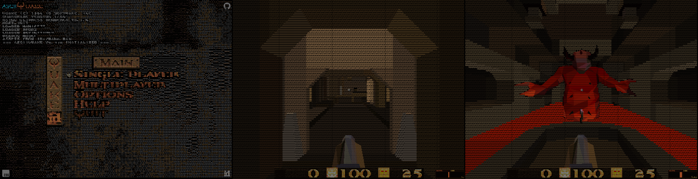

# asciiQuake 👹

A port of id Software's [Quake](https://github.com/id-software/quake) that renders BSP worlds as ASCII text through [GlyphCSS](https://glyphcss.com/), without a WebGL or canvas renderer. asciiQuake preprocesses original Quake data into compact browser-ready geometry and runs the game in TypeScript.

asciiQuake is a fork of [cssQuake](https://github.com/LayoutitStudio/cssQuake), created by [Layoutit](https://layoutit.com/). It keeps the source-backed Quake preparation and browser gameplay systems while replacing the DOM-polygon renderer with GlyphCSS-native scene, camera, and first-person controls.

Play the live version: [asciiquake.wtf](https://asciiquake.wtf)



## How to Play

Install dependencies and generate the Quake assets once. Set either `QUAKE_SHAREWARE_URL` for the Quake 1.06 shareware archive, or `QUAKE_PAK_PATH` for a local `pak0.pak`:

```sh
pnpm install
export QUAKE_SHAREWARE_URL="<Quake 1.06 shareware zip URL>"
# or: export QUAKE_PAK_PATH=".local/quake/pak0.pak"
pnpm prepare:quake
```

After the assets exist, run the local dev server:

```sh
pnpm dev
```

`pnpm build` only builds the Vite app. Use `pnpm build:full` when you want to regenerate Quake assets and build the app in one command.

## How It Works

asciiQuake feeds prepared world and model polygons directly into [GlyphCSS](https://glyphcss.com/).

GlyphCSS rasterizes the retained geometry to a character grid and paints each scene layer into a `<pre>` element. Its colour-font atlas keeps a frame to one text node instead of creating a DOM node per polygon or colour run.

The world, moving brush models, monsters, pickups, projectiles, and first-person weapon share this retained GlyphCSS scene. TypeScript owns gameplay and collision independently from the render DOM.

`src/App.ts` loads generated map/model JSON from `/q` and registers its compact GlyphCSS geometry. Gameplay systems connect that scene to visibility, lightstyles, doors, buttons, brush-model movement, pickups, hazards, weapon feedback, HUD/menu state, and level transitions.

The browser does not parse the original PAK or BSP files while the game is running. Generated game assets are intentionally ignored by Git.

## Build and Runtime

asciiQuake splits Quake-like behavior between prepared source-backed facts and a TypeScript-owned runtime.

`src/prepare/assets.mjs` downloads the Quake 1.06 shareware archive from `QUAKE_SHAREWARE_URL`, verifies the extracted `resource.1`, extracts `ID1/PAK0.PAK`, and writes browser-ready assets under the ignored `build/generated/public/q` folder.

The prepare step parses original BSP, WAD, MDL, LMP, entity, visibility, collision, HUD, menu, pickup, weapon, and QuakeC-derived gameplay data. It emits compact world/model polygons, PVS metadata, palette-derived colours, UI assets, and gameplay facts so the browser does not rebuild source geometry at startup.

The runtime is not a Quake VM. TypeScript owns the browser game loop, player movement, collision response, enemy state, pickups, weapons, UI, audio, routing, and debug hooks; GlyphCSS owns projection and text rendering. When asciiQuake needs a more faithful behavior, the default is to add a prepared fact from the original source material first, then consume it through explicit TypeScript systems.

## URL API

asciiQuake keeps its shareable game state in small, Quake-native URL parameters. `map=e1m1` opens a map directly, and `view=x,y,z,pitch,yaw,roll` places the player at a Quake-style pose: origin in Quake units, with pitch, yaw, and roll in degrees.

```text
https://asciiquake.wtf/?map=e1m1&view=480,-192,72,0,90,0
```

This makes a URL behave like a lightweight console command for reproducing bugs, sharing exact views, capturing screenshots, and comparing asciiQuake against native Quake tools such as vkQuake. Roll must currently be zero because asciiQuake does not render camera roll yet.

Developer-oriented params such as `debugPolys=1`, `debugFly=1`, `debugPointer=1`, `perspective=...`, and `zoom=...` are kept separate from the core route so debug sessions can be reproduced without turning the URL API into a save system.

## Embedding

asciiQuake can run inside an iframe. Add `relayKeys=1` if the parent page wants filtered gameplay key events from the focused game iframe:

```html
<iframe
  src="https://asciiquake.wtf/?relayKeys=1"
  allow="pointer-lock; fullscreen"
  referrerpolicy="origin"
></iframe>
```

When enabled, asciiQuake posts `cssquake:key` messages for gameplay keys only. Parent pages should validate `event.origin` before reading them. Using `referrerpolicy="no-referrer"` disables the relay because asciiQuake will not have a parent origin to target.

## License

asciiQuake source code is [GPL-2.0-only](LICENSE). Original Quake game data is not included in this repository; the prepare step reads shareware or local PAK input and writes ignored generated assets for local or deployed use.
